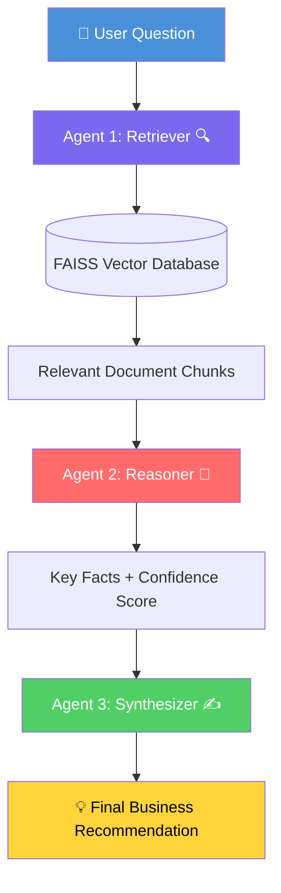

# 🤖 Multi-Agent RAG System

> Enterprise Knowledge Q&A powered by 3 specialised AI agents

## 🌐 Live Demo
👉 **[Try the app live](https://sadhvika-multi-agent-rag.streamlit.app)**

## 🎯 What it does
Ask any business question in plain English and get an AI-powered answer with business recommendations — sourced directly from your company documents.

No SQL. No coding. Just ask.

## 🏗️ Architecture



## 🤖 The 3 agents

| Agent | Role | What it does |
|-------|------|-------------|
| 🔍 Retriever | Search | Searches FAISS vector database for relevant document chunks |
| 🧠 Reasoner | Analyse | Extracts key facts, rates confidence, identifies gaps |
| ✍️ Synthesizer | Communicate | Writes clear business recommendation for executives |

## 🛠️ Tech stack


## 📁 Project structure

    multi-agent-rag-system/
    ├── agents/
    │   ├── retriever_agent.py    ← Agent 1: searches vector DB
    │   ├── reasoner_agent.py     ← Agent 2: analyses facts
    │   └── synthesizer_agent.py  ← Agent 3: writes recommendations
    ├── data/
    │   ├── company_knowledge.txt ← knowledge base document
    │   └── faiss_index/          ← vector database
    ├── app.py                    ← Streamlit web interface
    ├── main.py                   ← CLI pipeline runner
    └── requirements.txt

## 🚀 How to run locally

```bash
# Clone the repo
git clone https://github.com/Sadhvika-Sunkara/multi-agent-rag-system.git
cd multi-agent-rag-system

# Install dependencies
pip install -r requirements.txt

# Add your OpenAI API key
echo "OPENAI_API_KEY=your-key-here" > .env

# Build knowledge base
python agents/retriever_agent.py

# Run the web app
streamlit run app.py
```

## 💡 Sample questions to try
- "What is the company revenue?"
- "What are the HR policies for annual leave?"
- "What is the product roadmap for 2026?"
- "What cloud infrastructure does the company use?"

## 📊 Key results
- ✅ 3 specialised agents working in pipeline
- ✅ Sub-5 second response time
- ✅ Transparent reasoning with confidence scoring
- ✅ Honest uncertainty flagging
- ✅ Deployed live with public URL

## 🎓 Skills demonstrated
- Large Language Models (LLMs) and prompt engineering
- Retrieval-Augmented Generation (RAG) architecture
- Multi-agent system design
- Vector databases (FAISS)
- Python application development
- Streamlit deployment

---
*Built as part of an AI engineering portfolio — Sadhvika Sunkara | MDS @ Macquarie University*